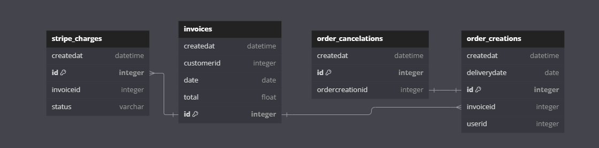
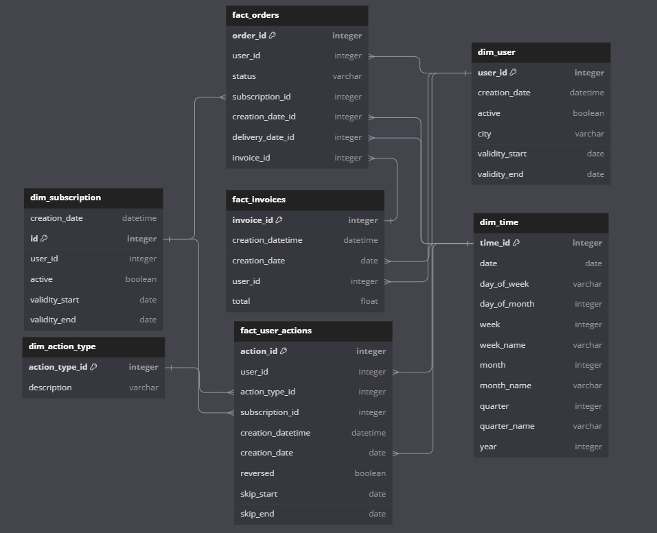

# Cook Unity assignment

This exercise will provide an hypothetical overview of business models at CookUnity. It's focused on the different actions our clients can take in the app.

## Map the relationship of our order and invoice tables above. Also note any potential issues in being able to join these tables reliably. 

Orders and invoices are two tables related by the invoice_id. As I have the invoice_id foreign key in the order_creations table, this implies that one order creation is related to one invoice. On the other hand, I'm going to assume a one-to-many relationship between invoices and order creations, meaning that one invoice could be associated with multiple order creations.

In terms of potential issues, these are the most important points:

- Data Consistency: the invoice_id could be null if the order is not yet confirmed, this will cause referential integrity violation. Maybe a status could be added a status to the order for clarity or introduce a special default row in the dimension table for the “Pending” record.
- Amount related to an order: To calculate the amount associated to only an order, a partition of the amount of the invoice has to be calculated. As the amount at order leve is not known. This is only informed at invoice level. So, for example, if summing the amount and order_creations is added to the join, this would shield incorrect results.
- Handling invoices: in the process of confirming the order, a new record has to be added to the invoices table, and the relationship with their respective orders has to be generated with the invoice ID.
- Invoice status: it could be worth it to add the status of the invoice (confirmed, pending, etc.). That way revenue could that it's already charged be reflected.

This is the entity relationship model I think represents the current structure:



## Produce a conceptual and logical model diagram that identifies and labels the entities, classifies each entity as either **objects** (dimensions) or **events** (facts) and establishes how they **relate** to each other (e.g. “has many”, “has one”, “belongs to”)

In terms of modeling I can think of the following entities:

- User: Represents the individual customers. This would be a dimension table.
- Subscription: Represents the subscription plans chosen by users. This would be a dimension table.
- Order: Represents the action of placing an order. This would be a fact table and our grain.
- Invoice: Represent the document that records the transaction. This would be a fact table.
- Action: Represents various user actions a user can make. This would be a fact table.
- Action type: Represents the type of actions (skipping orders, pausing account) available. This would be a dimension table.

In this model, an user can have one subscription, perform multiple actions, generate multiple orders and have multiple invoices associated to him. A subscription is associated to one user, multiple orders can be put through it, and multiple actions can be done to it. An invoice can be associated to multiple orders, but one user. An order is placed by one user, is associated with one subscription and it's documented in one invoice. Also, an action is related to one user, associated to one subscription and it has one action type. Finally, an action type is related to multiple actions. This would be the main idea:



I think this model allow us to have flexibility and adaptability, as more information about orders can be added adding lookup attributes to the existing fact table and new dimension tables. In regards to the dimensional tables, action types would be SCD of Type 1, as I think a history of changes is not needed, but for users and subscriptions I'm going to go with Type 2, as it would be useful to track changes and allow a historic analysis.


## 3. Using SQL, design and create new table/s (dimensions and facts) that analysts could use to easily analyze: - each week, - what percentage of our users: placed an order, skipped, paused or cancelled (churned)

```bash
docker build -t ingest_data:v001 .
```

Based on the first model and to transform it to my conceptual model I would generate my tables as:

```sql
CREATE TABLE fact_orders (
    order_id INTEGER PRIMARY KEY,
    user_id INTEGER,
    status VARCHAR(255),
    subscription_id INTEGER,
    creation_datetime TIMESTAMP,
    creation_date DATE,
    delivery_datetime TIMESTAMP,
    delivery_date DATE,
    invoice_id INTEGER
);

CREATE TABLE fact_user_actions (
    action_id INTEGER PRIMARY KEY,
    user_id INTEGER,
    action_type_id INTEGER,
    subscription_id INTEGER,
    creation_date DATE,
    creation_datetime TIMESTAMP,
    reversed BOOLEAN,
    skip_start DATE,
    skip_end DATE
);

CREATE TABLE fact_invoices (
    invoice_id INTEGER PRIMARY KEY,
    creation_datetime TIMESTAMP,
    creation_date TIMESTAMP,
    user_id INTEGER,
    status VARCHAR(255),
    total FLOAT
);

CREATE TABLE dim_action_type (
    action_type_id INTEGER PRIMARY KEY,
    description VARCHAR(255)
);

CREATE TABLE dim_user (
    register_id INTEGER PRIMARY KEY,
    user_id INTEGER,
    creation_date TIMESTAMP,
    active BOOLEAN,
    city VARCHAR(255),
    validity_start DATE,
    validity_end DATE
);

CREATE TABLE dim_subscription (
    id INTEGER PRIMARY KEY,
    creation_date DATE,
    creation_datetime TIMESTAMP,
    user_id INTEGER,
    active BOOLEAN,
    validity_start TIMESTAMP,
    validity_end TIMESTAMP
);

CREATE TABLE dim_time (
    time_id SERIAL PRIMARY KEY,
    date DATE,
    day_of_week VARCHAR(10),
    day_of_month INTEGER,
    week INTEGER,
    week_name VARCHAR(20),
    month INTEGER,
    month_name VARCHAR(20),
    quarter INTEGER,
    quarter_name VARCHAR(20),
    year INTEGER
);
```

Based on this conceptual model, I would load the data with the following script
```sql
INSERT INTO dim_time (time_id, date, day_of_week, day_of_month, week, week_name, month, month_name, quarter, quarter_name, year)
SELECT
    CAST(to_char(date, 'YYYYMMDD') AS INTEGER),
    date::DATE,
    to_char(date, 'Day') AS day_of_week,
    EXTRACT(DAY FROM date) AS day_of_month,
    EXTRACT(WEEK FROM date) AS week,
    to_char(date, 'WW') AS week_name,
    EXTRACT(MONTH FROM date) AS month,
    to_char(date, 'Month') AS month_name,
    EXTRACT(QUARTER FROM date) AS quarter,
    'Q' || to_char(date, 'Q') AS quarter_name,
    EXTRACT(YEAR FROM date) AS year
FROM
    generate_series('2020-01-01'::DATE, '2022-12-31'::DATE, '1 day'::INTERVAL) AS date;

INSERT INTO dim_subscription (id,creation_date,creation_datetime, user_id, active, validity_start, validity_end)
WITH intervals AS (
    SELECT
        "USERID",
        "CREATEDAT",
        "DATE" AS validity_start,
        LEAD("DATE") OVER (PARTITION BY "USERID" ORDER BY "CREATEDAT") AS validity_end,
        LAG("EVENT") OVER (PARTITION BY "USERID" ORDER BY "CREATEDAT") AS prev_event,
        "EVENT"
    FROM
        subscription_events
)
SELECT
    ROW_NUMBER() OVER(),
	DATE(MIN("CREATEDAT") OVER (PARTITION BY "USERID")),
	TO_TIMESTAMP(MIN("CREATEDAT") OVER (PARTITION BY "USERID"), 'YYYY-MM-DD HH24:MI:SS'),
    "USERID",
    CASE
        WHEN (prev_event IS NULL AND "EVENT" = 'subscribe') OR
             (prev_event = 'unsubscribe' AND "EVENT" = 'subscribe') THEN true
        ELSE false
    END AS active,
    DATE(validity_start),
    DATE(COALESCE(validity_end, '9999-12-31'))
FROM intervals;

INSERT INTO dim_action_type(action_type_id, description)
	VALUES (1, 'pause'),(2,'skip');

INSERT INTO dim_user (register_id, user_id, creation_date, active, city, validity_start, validity_end)
WITH intervals AS (
    SELECT
        "USERID",
        DATE("CREATEDAT") AS "CREATEDAT",
        "DATE" AS validity_start,
        LEAD("DATE") OVER (PARTITION BY "USERID" ORDER BY "CREATEDAT") AS validity_end,
        LAG("EVENT") OVER (PARTITION BY "USERID" ORDER BY "CREATEDAT") AS prev_event,
        "EVENT"
    FROM
        subscription_events
)
SELECT
    ROW_NUMBER() OVER(),
    "USERID",
    MIN("CREATEDAT") OVER (PARTITION BY "USERID") AS creation_date,
    CASE
        WHEN (prev_event IS NULL AND "EVENT" = 'subscribe') OR
             (prev_event = 'unsubscribe' AND "EVENT" = 'subscribe') THEN true
        ELSE false
    END AS active,
    '' AS city,
    DATE(validity_start),
    DATE(COALESCE(validity_end, '9999-12-31'))
FROM intervals;

INSERT INTO fact_orders (order_id, user_id, status, subscription_id, creation_datetime, creation_date, delivery_datetime, delivery_date, invoice_id)
WITH cancellations AS (
    SELECT DISTINCT "ORDERCREATIONID" AS id, 'Cancelled' AS status
    FROM order_cancelations 
)
SELECT
    "ID",
    "USERID",
    CASE WHEN status IS NULL AND "INVOICEID" IS NULL THEN 'Pending' 
         WHEN status IS NULL AND "INVOICEID" IS NOT NULL THEN 'Confirmed' 
         ELSE status 
    END AS status,
    s.id AS subscription_id,
    TO_TIMESTAMP("CREATEDAT", 'YYYY-MM-DD HH24:MI:SS'),
    DATE("CREATEDAT"),
    TO_TIMESTAMP("DELIVERYDATE", 'YYYY-MM-DD HH24:MI:SS'),
    DATE("DELIVERYDATE"),
    "INVOICEID"
FROM 
    order_creations oc
LEFT JOIN 
    dim_subscription s ON oc."USERID" = s.user_id AND TO_TIMESTAMP(oc."CREATEDAT", 'YYYY-MM-DD HH24:MI:SS') BETWEEN s.validity_start AND s.validity_end
LEFT JOIN 
    cancellations ON cancellations.id = oc."ID";

INSERT INTO fact_invoices (invoice_id, creation_date, user_id, total, status)
WITH invoice_status AS (
    SELECT *, ROW_NUMBER() OVER (PARTITION BY "INVOICEID" ORDER BY "CREATEDAT" DESC) AS last_status 
    FROM stripe_charges ORDER BY "INVOICEID", "CREATEDAT"
)
SELECT 
    invoices."ID",
    TO_TIMESTAMP(invoices."CREATEDAT", 'YYYY-MM-DD HH24:MI:SS'),
    "CUSTOMERID",
    "TOTAL",
    "STATUS"
FROM 
    invoices
LEFT JOIN 
    invoice_status ON invoices."ID" = invoice_status."INVOICEID" AND invoice_status.last_status = 1;

INSERT INTO fact_user_actions (action_id, user_id, action_type_id, subscription_id, creation_date, creation_datetime, reversed, skip_start, skip_end)
SELECT 
    ROW_NUMBER() OVER(),
    "USERID",
    CASE WHEN "ISPAUSED" THEN 1 ELSE 2 END AS action,
    s.id,
    DATE(skips."CREATEDAT"),
    TO_TIMESTAMP(skips."CREATEDAT", 'YYYY-MM-DD HH24:MI:SS'),
    CASE WHEN unskips."ID" IS NOT NULL THEN true ELSE false END AS reversed,
    MIN(DATE("DATE")) AS skip_start,
    MAX(CASE WHEN "ISPAUSED" THEN DATE("DATE") ELSE DATE(DATE("DATE") + interval '7' day) END) AS skip_end
FROM 
    skips
LEFT JOIN 
    unskips ON skips."ID" = unskips."SKIPID"
LEFT JOIN 
    dim_subscription s ON skips."USERID" = s.user_id AND TO_TIMESTAMP(skips."CREATEDAT", 'YYYY-MM-DD HH24:MI:SS') BETWEEN s.validity_start AND s.validity_end
GROUP BY 
    2, 3, 4, 5, 6;
```


In terms of assumptions:
- The order cancellations table has multiple records for one order, but the cancelation is a final state, so no order can be cancelled two times. I take this as a data error.
- The skips table have two dates "CREATEDAT" and "DATE" that I assume refer to when the skip was made and the date that will be skipped. In case of pauses, it represents the dates related to that pause, and in case of a skip, the week that it's going to be skipped.
- The skips table has values created with difference in seconds, I'm going to use the date without time in order to identify the duration of the pause.


We can create a new gold layer table for the analysts with all the information already grouped:


```sql
CREATE TABLE weekly_user_metrics (
    year INTEGER,
    week VARCHAR(2),
    order_ratio DECIMAL,
    skip_ratio DECIMAL,
    pause_ratio DECIMAL,
    unsubscription_ratio DECIMAL
);
```


```sql
INSERT INTO public.weekly_user_metrics(year, week, order_ratio, skip_ratio, pause_ratio, unsubscription_ratio)
WITH subscriptions AS (
    SELECT
        dt.year,
        dt.week_name,
        COUNT(DISTINCT user_id) AS unsubscriptions
    FROM
        dim_subscription ds
    LEFT JOIN
        dim_time dt ON ds.validity_start = dt.date
    WHERE
        NOT active
    GROUP BY
        dt.year,
        dt.week_name
),
skips AS (
    SELECT
        dt.year,
        dt.week_name,
        COUNT(DISTINCT CASE WHEN dat.description = 'skip' THEN user_id END) AS skips,
        COUNT(DISTINCT CASE WHEN dat.description = 'pause' THEN user_id END) AS pauses
    FROM
        fact_user_actions fua
    LEFT JOIN
        dim_time dt ON fua.creation_date = dt.date
    LEFT JOIN
        dim_action_type dat ON fua.action_type_id = dat.action_type_id
    WHERE
        NOT reversed
    GROUP BY
        dt.year,
        dt.week_name
),
orders AS (
    SELECT
        dt.year,
        dt.week_name,
        COUNT(DISTINCT user_id) AS orders
    FROM
        fact_orders fo
    LEFT JOIN
        dim_time dt ON fo.creation_date = dt.date
    WHERE
        status <> 'Cancelled'
    GROUP BY
        dt.year,
        dt.week_name
),
users AS (
    SELECT
        dt.year,
        dt.week_name,
        COUNT(DISTINCT user_id)::decimal AS active_users
    FROM
        dim_user du
    LEFT JOIN
        dim_time dt ON dt.date BETWEEN du.validity_start AND du.validity_end
    WHERE
        active AND dt.date < '2022-03-04'-- CURRENT_DATE()
    GROUP BY
        dt.year,
        dt.week_name
)
SELECT
    year,
    week_name,
    ROUND((COALESCE(orders, 0) * 100 / active_users), 2) AS order_ratio,
    ROUND((COALESCE(skips, 0) * 100 / active_users), 2) AS skip_ratio,
    ROUND((COALESCE(pauses, 0) * 100 / active_users), 2) AS pause_ratio,
    ROUND((COALESCE(unsubscriptions, 0) * 100 / active_users), 2) AS unsubscription_ratio
FROM
    users
LEFT JOIN
    subscriptions USING (year, week_name)
LEFT JOIN
    skips USING (year, week_name)
LEFT JOIN
    orders USING (year, week_name);
```